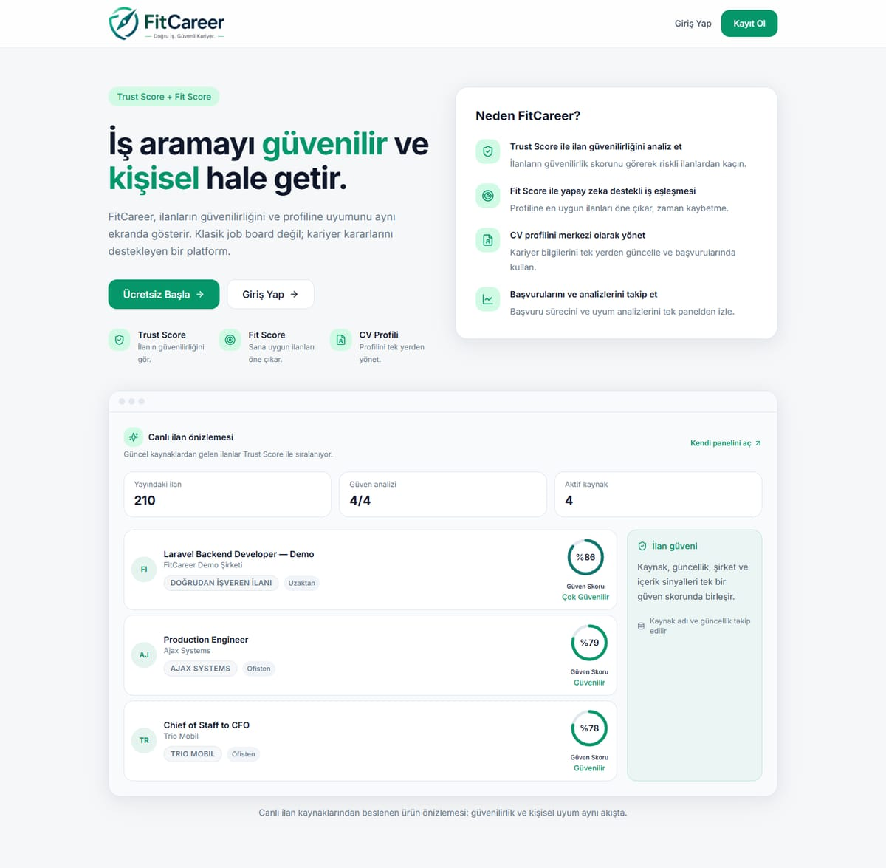
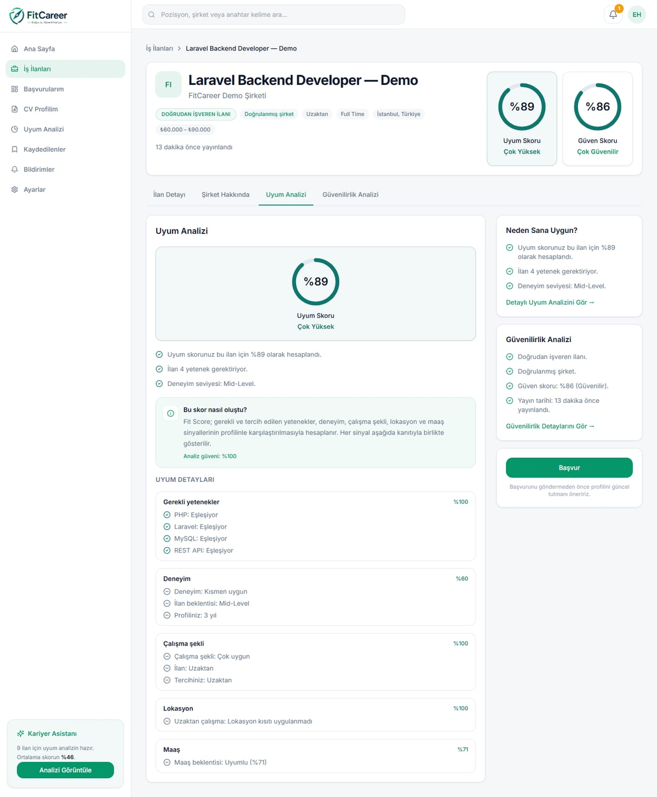
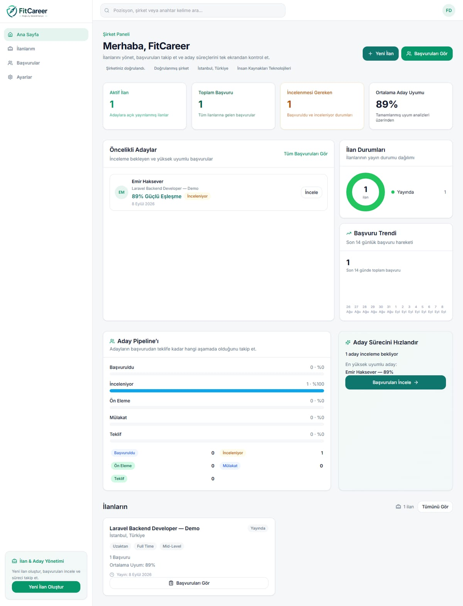
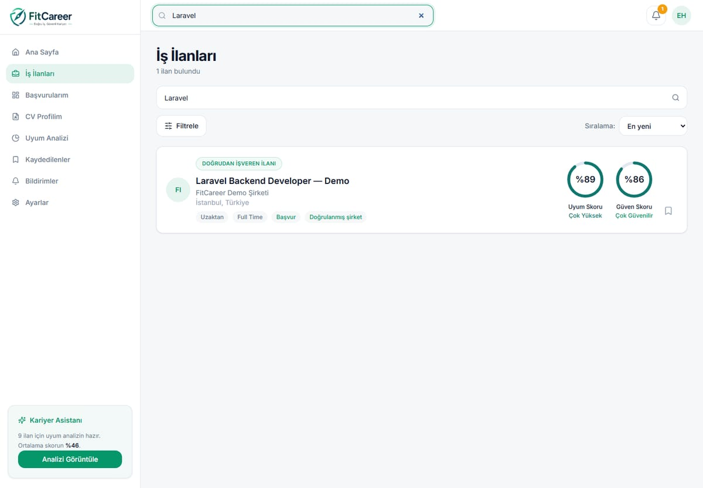

# FitCareer

Aday ve işveren için iş platformu. Laravel API + React / TypeScript arayüz: kayıt/giriş, CV profili, iş arama, ilan taslak/yayın, başvuru, doğrulama, Trust Score ve Fit Score.

Türkiye genelindeki ilanlar, şirketlerin kendi ilan sistemlerinin (ATS) herkese açık API'lerinden düzenli olarak çekilir; her ilan için güvenilirlik (Trust Score) ve adaya uyum (Fit Score) hesaplanır.

Personal portfolio project — not a company codebase.

**Canlı demo:** [fitcareer.emirhaksever.com](https://fitcareer.emirhaksever.com) · **Case study:** [emirhaksever.com/proje/fitcareer-guvenilir-is-eslestirme-platformu.html](https://emirhaksever.com/proje/fitcareer-guvenilir-is-eslestirme-platformu.html)



| Açıklanabilir Fit Score | Şirket paneli ve aday pipeline'ı |
|---|---|
|  |  |



> Ekran görüntüleri demo verisiyle alınmıştır. Demo aday hesabındaki kişi kurgusaldır (`scripts/demo-persona.php`).

## Stack

| Layer | Technology |
|-------|------------|
| Backend | Laravel 12, PHP 8.2+, MySQL |
| Frontend | React 19, TypeScript, Vite, Tailwind CSS |
| Queue | Database driver (`queue_jobs` table) |
| Auth | Laravel Sanctum |

## Requirements

- PHP 8.2+ with extensions: `pdo_mysql`, `mbstring`, `openssl`, `tokenizer`, `xml`, `ctype`, `json`, `bcmath`
- Composer 2.x
- Node.js 20+ and npm
- MySQL 8+
- XAMPP (or equivalent) for local Apache + MySQL

## Quick Start

### 1. Backend

```bash
cp .env.example .env
composer install
php artisan key:generate
php artisan migrate
php artisan db:seed   # if seeders exist
```

Configure `.env` with your database credentials and optional API keys (`GEMINI_API_KEY`, `JOOBLE_API_KEY`, etc.).

Serve via XAMPP: point document root to `public/` or use `php artisan serve`.

### 2. Frontend

```bash
cd frontend
npm install
npm run dev
```

Vite proxies `/api` to the Laravel backend (see `frontend/vite.config.ts`).

### 3. Job ingestion (optional)

İlanlar 5 ATS entegrasyonundaki 61 aktif kaynaktan çekilir (Eylül 2026):

- Lever
- Greenhouse
- Workable
- Ashby
- Recruitee

Kariyer.net için bir HTML ayrıştırıcı da vardır, ancak site otomatik erişimi bot korumasıyla engellediği için canlıda kullanılmaz.

Kaynak kayıtlarını oluşturup içe aktarma başlatmak için:

```bash
php scripts/seed-lever-sources.php
php scripts/seed-greenhouse-sources.php
php scripts/seed-workable-sources.php
php scripts/seed-ashby-sources.php
php scripts/seed-recruitee-sources.php

php artisan jobs:import-source <source-name> --sync
php artisan jobs:source-health
```

Nasıl çalışır:

- **Türkiye önceliği (`turkey_first`):** Kaynağın yalnızca Türkiye'deki (veya Türkiye'den uzaktan) ilanları alınır. Çok ülkeli ilanlarda Türkiye satırı korunur; yabancı ülke açıkça yazılıysa şehir adı benzerliği (ör. "Villa d'Agri" / Ağrı) ilanı Türkiye'ye taşımaz.
- **Tazelik:** Her içe aktarmada görülen ilanın `last_seen_at` alanı güncellenir. 48 saat kaynağında görülmeyen ilan bayat sayılır, ardından yayından kalkar. İlan detayında "Son kontrol" bilgisi bu alandan gelir.
- **Trust Score etiketleri:** 75+ Güvenilir, 50–74 Orta Güven, 30–49 Şüpheli, 30 altı Düşük Güven; skoru olmayan ilan "Değerlendirilmedi" (`config/trust_score.php`).
- **Genel istatistik:** `GET /api/v1/stats` yayındaki ilan, güven analizi yapılmış ilan ve aktif kaynak sayısını döndürür.

## Project Structure

```
app/Services/Scraper/   # Job ingestion pipeline
frontend/src/         # React SPA
database/migrations/  # Schema
tests/                # PHPUnit tests
scripts/              # One-off seed & diagnostic scripts
```

## Tests

```bash
# Backend
php artisan test

# Frontend
cd frontend && npm test
```

## Security

- Never commit `.env` or API keys.
- Use `.env.example` as the template for required variables.

## License

Proprietary — all rights reserved unless otherwise specified.
